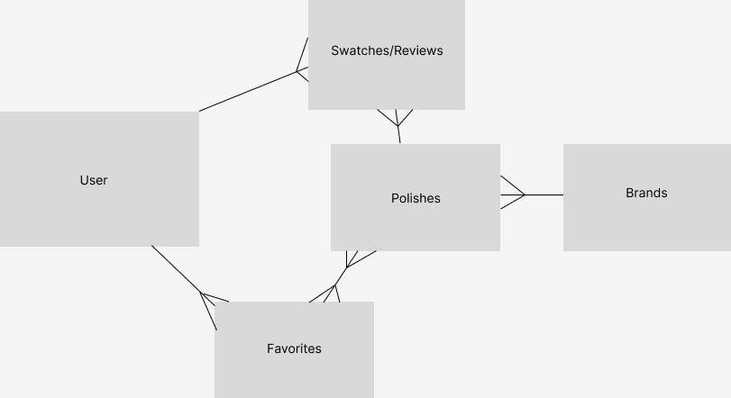
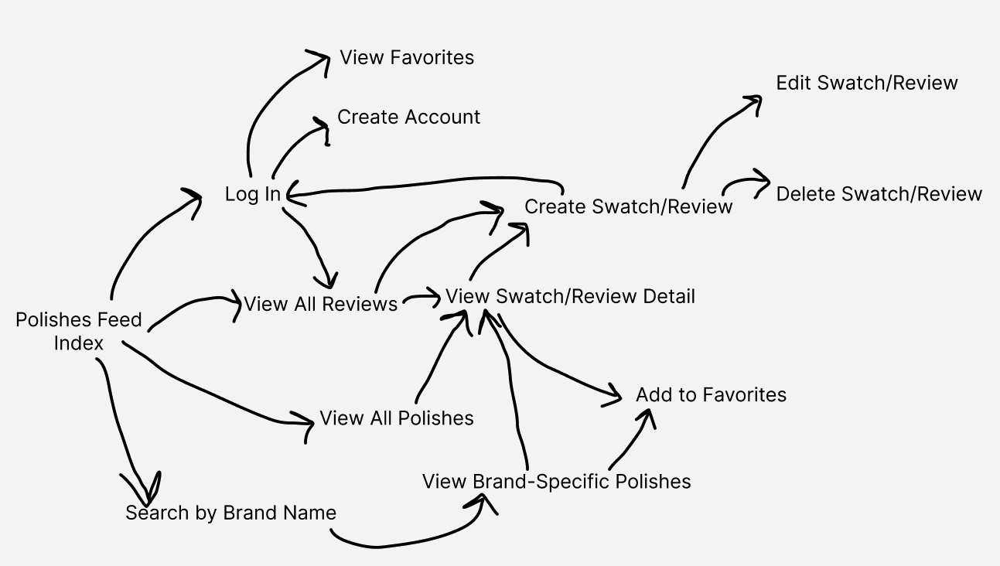

# Polished: Nail Polish Swatches & Reviews
## Project Summary
Polished is a nail polish swatch and review site where users can view other people’s swatches and reviews of different polishes, as well as leave their own swatches and reviews. They will also be able to save polishes to their list of favorites, and follow links to where they can purchase polishes.

 

## User Story:
As a user, I am a lover of nail polish and have arrived on the page looking for swatches and reviews of a few polishes I’ve heard of. 

I land on the homepage and see a welcome message that reads ‘Welcome to Polished! Select a polish below to see swatches and read reviews, or search by polish or brand name above.’ Below the welcome message is a feed of images with the names and brands of the polishes pictured. 

In the header, I see three navigation options:
- Search by polish name
- Search by brand name,
- Log in button. 

I scroll down the page a bit and see a polish that looks nice, so I click on it. I’m taken to a page that has a feed of all the polish swatches and reviews for that color. 

At the top of the page there are three buttons:
- Add a Swatch!
- Add to Favorites
- Buy Now

I scroll down and see different images that have been submitted by different people, with their thoughts on the color. I like this color, so I click on ‘Add to Favorites’. 

Since I am not logged in, I are taken to the log-in page. I do not have an account, so I click on ‘Create Account’ and am taken to the Create Account page, where I enter a username and password to create my account. 

I am redirected back to the polish color I was looking at, where I click on ‘Add to Favorites’. I am taken to my favorites page, which now has this color on it. 

Below the name and image of the color, there is a ‘Buy Now’ button, which takes me to the Amazon page where I can buy this polish color.

 

## Wireframes:
Homepage:

Detail Page:

Create Account:

Login:

Add Swatch:

Favorites Page:

## ERD & User Flow:

 

## Feature Lists
### MVP:
- View all polish swatches
- Search by color or brand
- See detail view of a polish, which has all the swatches that have been submitted for that color
- Create an account
- Create your own swatch and review of a color
- Edit your swatches/reviews
- Delete your swatches/reviews

### Stretch:
- Add polishes to your list of favorites
- Add tags to your reviews
- Super simple storefront where you can purchase polishes you like 

 

## Milestones:
- Essential Features:
    - View all swatches (index route) [EOD MON 1/30]
    - Search (by brand/by color) [EOD MON 1/30]
    - Create a swatch/review [EOD TUES 1/31]
    - Edit a swatch/review [EOD TUES 1/31]
    - Delete a swatch/review [EOD TUES 1/31]
    - View swatches of specific color (detail route) [EOD WEDS 2/1]
    - Basic styling [EOD THURS 2/2]

 

- Important but not Essential:
    - Create Account/auth [EOD FRI 2/3]
    - Polished styling [WEEKEND]
    - Add polishes to favorites list [WEEKEND]

 

- Future Features:
    - Add tags to reviews
    - Storefront to purchase polishes